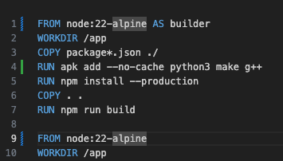

# hook.cafe

With this app I pay tribute to my dear friend's cafe "Hook" in Beirut. A very special place where if you come as a stranger, you will quickly make new friends. The purpose of this app is to replicate the cafe Hook idea everywhere in the world. It aims to be simple to use, with the only focus on helping people to go outside, eat luch, drink coffee, have a chat or play chess, always with a group of nice people. In other words, a Mediterranean lifestyle exported to other cities of the world. 

Please note: This is very much WIP!

## Running locally

### a) dev mode
It is recommended to test with locally running relay. Then create `.env` file with relay url:
```
PUBLIC_RELAY_URL=ws://127.0.0.1:8080
```
Once you've installed dependencies with `npm install`, start dev server:
```bash
npm run dev
```
### b) docker
If you don't want to make any changes you can just build the app and run in docker:
```bash
docker build -t hookcafe .
docker run --name hookcafe -p 3000:3000 hookcafe

# or you can pass relay URL:
docker run --name hookcafe -e PUBLIC_RELAY_URL=wss://your-nostr-relay.com -p 3000:3000 hookcafe
```
#### macos
for macos build you may need to make these changes:



##### Attribution
The project uses photos/images from https://unsplash.com/.